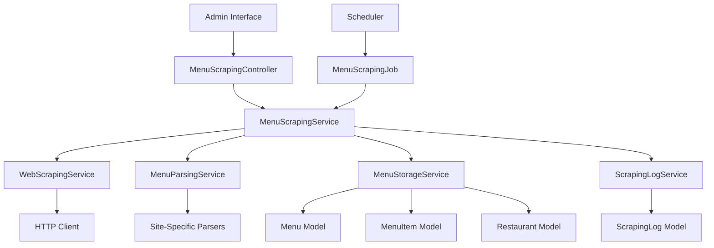

# Design Document

## Overview

The menu scraping feature will enable system administrators to extract menu data from restaurant websites and populate the database with structured menu item information. The system will be built as a Laravel service that integrates with the existing restaurant management system, providing both manual and scheduled scraping capabilities with comprehensive monitoring and error handling.

## Architecture

The menu scraping system follows a service-oriented architecture within the Laravel framework:



### Core Components

1. **MenuScrapingController**: Handles admin requests for manual scraping
2. **MenuScrapingService**: Orchestrates the scraping process
3. **WebScrapingService**: Manages HTTP requests and rate limiting for HTML and PDF content
4. **MenuParsingService**: Extracts menu data from HTML content and PDF files
5. **PdfParsingService**: Specialized service for PDF text extraction and parsing
6. **MenuStorageService**: Handles database operations for menu items
7. **ScrapingLogService**: Manages logging and monitoring
8. **MenuScrapingJob**: Handles scheduled scraping tasks

## Components and Interfaces

### MenuScrapingService

Primary service that coordinates the entire scraping process:

```php
interface MenuScrapingServiceInterface
{
    public function scrapeRestaurant(Restaurant $restaurant): ScrapingResult;
    public function scrapeMultipleRestaurants(array $restaurantIds): array;
    public function getScrapingHistory(Restaurant $restaurant): Collection;
}
```

### WebScrapingService

Handles HTTP requests with rate limiting and error handling for both HTML and PDF content:

```php
interface WebScrapingServiceInterface
{
    public function fetchMenuContent(string $url): ?array; // returns ['content' => string, 'type' => 'html|pdf']
    public function downloadPdf(string $url): ?string; // returns local file path
    public function isUrlAccessible(string $url): bool;
    public function respectsRobotsTxt(string $url): bool;
    public function getContentType(string $url): string;
}
```

### MenuParsingService

Extracts structured data from HTML content and PDF files:

```php
interface MenuParsingServiceInterface
{
    public function parseMenuContent(string $content, string $url, string $contentType = 'html'): array;
    public function detectMenuFormat(string $content, string $contentType): string;
    public function getSupportedFormats(): array; // html, pdf
    public function parsePdfMenu(string $pdfPath): array;
}
```

### PdfParsingService

Specialized service for PDF text extraction and menu parsing:

```php
interface PdfParsingServiceInterface
{
    public function extractTextFromPdf(string $pdfPath): string;
    public function parseMenuFromText(string $text): array;
    public function detectMenuStructure(string $text): array;
    public function cleanupTempFiles(string $pdfPath): void;
}
```

### MenuStorageService

Manages database operations for menus and menu items:

```php
interface MenuStorageServiceInterface
{
    public function createMenu(Restaurant $restaurant, array $menuData): Menu;
    public function storeMenuItems(Menu $menu, array $menuItems): int;
    public function updateExistingItems(Menu $menu, array $menuItems): int;
    public function deactivateOldMenus(Restaurant $restaurant, Menu $currentMenu): void;
    public function findSimilarItems(Restaurant $restaurant, string $itemName): Collection;
}
```

## Data Models

### Enhanced Restaurant Model

The existing Restaurant model will be extended to support menu scraping:

```php
// Additional fields to be added via migration
- menu_url: string (nullable) - URL of the restaurant's online menu
- menu_scraping_enabled: boolean (default false)
- last_menu_scrape: timestamp (nullable)
- menu_scrape_frequency: string (nullable) - daily, weekly, monthly
- scraping_notes: text (nullable) - admin notes about scraping configuration

// Relationships
- hasMany(Menu::class)
```

### New Menu Model

The Menu model will track different menu versions and types for each restaurant:

```php
// Fields to be added via migration
- id: primary key
- restaurant_id: foreign key to restaurants table
- name: string - menu name (e.g., "Lunch Menu", "Dinner Menu", "Drinks")
- menu_type: enum (scraped, manual, seasonal) - how the menu was created
- is_active: boolean (default true) - whether this menu is currently active
- scraped_at: timestamp (nullable) - when this menu was scraped
- source_url: string (nullable) - original URL where menu was found
- created_at: timestamp
- updated_at: timestamp

// Relationships
- belongsTo(Restaurant::class)
- hasMany(MenuItem::class)
```

### New MenuItem Model

The MenuItem model will store individual menu items linked to specific menus:

```php
// Fields to be added via migration
- id: primary key
- menu_id: foreign key to menus table
- name: string - menu item name
- description: text (nullable) - item description
- price: decimal(8,2) (nullable) - item price
- section: string (nullable) - menu section (burgers, pastas, beverages, etc.)
- order_index: integer (nullable) - for maintaining menu item order
- is_available: boolean (default true) - availability status
- created_at: timestamp
- updated_at: timestamp

// Relationships
- belongsTo(Menu::class)
- hasOneThrough(Restaurant::class, Menu::class)
```

### New ScrapingLog Model

Track scraping activities and results:

```php
// New model for tracking scraping operations
- id: primary key
- restaurant_id: foreign key to restaurants table
- scraping_type: enum (manual, scheduled)
- status: enum (success, failed, partial)
- items_found: integer (default 0)
- items_created: integer (default 0)
- items_updated: integer (default 0)
- error_message: text (nullable)
- scraped_at: timestamp
- duration_seconds: integer (nullable)
```

## Error Handling

### HTTP Request Errors
- **Connection timeouts**: Retry with exponential backoff (3 attempts)
- **Rate limiting (429)**: Implement delays and respect retry-after headers
- **Access denied (403/401)**: Log error and mark restaurant as inaccessible
- **Not found (404)**: Log error and suggest URL verification

### Parsing Errors
- **Unsupported format**: Log warning and skip restaurant
- **Malformed HTML**: Attempt basic parsing, log issues
- **PDF extraction failures**: Handle corrupted or password-protected PDFs
- **OCR limitations**: Handle image-based PDFs with poor text extraction
- **Missing price data**: Store items without prices, flag for manual review
- **Encoding issues**: Detect and convert character encoding

### Database Errors
- **Duplicate items**: Update existing records based on name and restaurant
- **Constraint violations**: Log detailed error information
- **Connection issues**: Retry operations with circuit breaker pattern

## Testing Strategy

### Unit Tests
- **MenuScrapingService**: Test scraping logic with mocked dependencies
- **WebScrapingService**: Test HTTP handling with fake responses
- **MenuParsingService**: Test parsing with sample HTML fixtures
- **MenuStorageService**: Test database operations with test database

### Integration Tests
- **End-to-end scraping**: Test complete flow with mock restaurant websites
- **Database integration**: Verify data persistence and relationships
- **Error scenarios**: Test handling of various failure conditions

### Feature Tests
- **Admin interface**: Test manual scraping through web interface
- **Scheduled jobs**: Test automated scraping functionality
- **API endpoints**: Test any API endpoints for scraping status

### Test Data Strategy
- Create HTML fixtures for common restaurant website formats
- Mock HTTP responses for different scenarios (success, failure, rate limiting)
- Use factory patterns for generating test restaurants and menu items
- Implement database transactions for test isolation

### Performance Testing
- **Rate limiting**: Verify respectful crawling behavior
- **Memory usage**: Test with large menu datasets
- **Concurrent scraping**: Test multiple restaurant scraping
- **Database performance**: Test bulk insert/update operations

## Security Considerations

### Web Scraping Ethics
- Respect robots.txt files and crawl delays
- Implement reasonable request intervals (minimum 1-2 seconds between requests)
- Use appropriate User-Agent strings identifying the application
- Monitor for and respond to rate limiting signals

### Data Validation
- Sanitize all scraped content before database storage
- Validate price formats and ranges
- Limit description lengths to prevent database overflow
- Escape HTML content in menu item descriptions

### Access Control
- Restrict scraping functionality to admin users only
- Log all scraping activities with user attribution
- Implement IP-based rate limiting for admin interface
- Secure storage of any API keys or credentials

## Monitoring and Logging

### Scraping Metrics
- Success/failure rates per restaurant
- Average scraping duration
- Number of items found vs. stored
- Error frequency by type

### Alerting
- Failed scraping attempts exceeding threshold
- Significant changes in menu item counts
- Repeated access denied errors
- System performance degradation

### Audit Trail
- Complete log of all scraping activities
- Changes to restaurant scraping configuration
- Manual interventions and their outcomes
- Data quality issues and resolutions