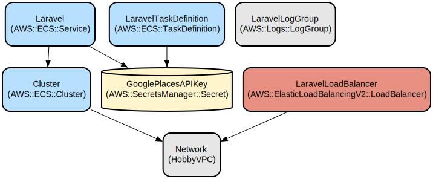

# Laravel Restaurant Directory

A modern Laravel 12.0 application for restaurant management and discovery, built with Jetstream, Livewire, and Tailwind CSS. This project provides a comprehensive platform for managing restaurant information with a focus on developer experience and production-ready deployment.

## Tech Stack

- **Backend**: Laravel 12.0 with PHP 8.2+
- **Frontend**: Livewire 3.0, Tailwind CSS 3.4, Vite 6.0
- **Authentication**: Laravel Jetstream with Sanctum
- **Database**: MySQL 8.0
- **Development**: Laravel Sail, Docker Compose
- **Testing**: PHPUnit 11.5
- **Code Quality**: Laravel Pint

## Prerequisites

- PHP 8.2 or higher
- Composer 2.x
- Node.js 16.x or higher
- Docker and Docker Compose
- Visual Studio Code (recommended)

## Development Workflow

### Quick Setup with Laravel Sail

1. **Clone and setup**:
```bash
git clone <repository-url>
cd laravel-restaurant-directory
cp .env.example .env
```

2. **Start development environment**:
```bash
# Start all services (Laravel, MySQL, Mailpit)
./vendor/bin/sail up -d

# Or use Docker Compose directly
docker-compose up -d
```

3. **Install dependencies and setup database**:
```bash
# Install PHP dependencies
./vendor/bin/sail composer install

# Install Node dependencies
./vendor/bin/sail npm install

# Generate application key
./vendor/bin/sail artisan key:generate

# Run migrations
./vendor/bin/sail artisan migrate

# Seed database (if seeders exist)
./vendor/bin/sail artisan db:seed
```

4. **Start development server**:
```bash
# Start the full development stack (server, queue, logs, vite)
./vendor/bin/sail composer dev

# Or start individual services
./vendor/bin/sail artisan serve  # Laravel server
./vendor/bin/sail npm run dev    # Vite dev server
```

### Alternative Development Options

#### VSCode Dev Containers
The project includes a `.devcontainer` configuration for seamless development:

1. **Setup**:
   - Install the "Dev Containers" extension in VSCode
   - Open project folder and select "Reopen in Container"
   - Container automatically extends the existing Docker Compose setup

2. **Features**:
   - Pre-configured development environment
   - Integrated terminal with Laravel Sail
   - Automatic port forwarding
   - Works with existing `docker-compose.yml`

#### AWS Cloud9 / CodeCatalyst
For cloud-based development, use the included `devfile.yaml`:

```bash
# Install dependencies
composer install && npm install

# Build assets
npm run build

# Run tests
php artisan test
```

## Common Development Tasks

### Daily Development Commands

```bash
# Start development environment
./vendor/bin/sail up -d

# Run the full development stack (recommended)
./vendor/bin/sail composer dev
# This runs: server + queue + logs + vite concurrently

# Individual commands
./vendor/bin/sail artisan serve          # Laravel development server
./vendor/bin/sail npm run dev           # Vite development server
./vendor/bin/sail artisan queue:listen  # Queue worker
./vendor/bin/sail artisan pail          # Real-time logs
```

### Accessing Services

- **Application**: http://localhost (port 80)
- **Vite Dev Server**: http://localhost:5173
- **Mailpit (Email testing)**: http://localhost:8025
- **MySQL**: localhost:3306

### More Detailed Examples

1. Adding a new restaurant via API:
```php
POST /api/restaurants
{
    "name": "Sample Restaurant",
    "address": "123 Main St",
    "cuisine_type": "Italian",
    "price_range": "$$",
    "opening_hours": "9:00 AM - 10:00 PM"
}
```

2. Updating restaurant information:
```php
PUT /api/restaurants/{id}
{
    "description": "Updated description",
    "phone": "+1234567890"
}
```

### Troubleshooting

1. Database Connection Issues
```bash
# Check database connection
php artisan db:monitor

# View logs
docker-compose logs -f laravel.test
```

2. Permission Issues
```bash
# Fix storage permissions
chmod -R 777 storage bootstrap/cache
```

3. Container Issues
```bash
# Rebuild containers
docker-compose down
docker-compose build --no-cache
docker-compose up -d
```

## Data Flow
The application follows a standard MVC architecture with additional integration to external services.

```ascii
[Client] -> [Load Balancer] -> [Laravel App Container]
                                      |
                                      v
[Google Places API] <-------- [Restaurant Controller]
                                      |
                                      v
                               [Database Layer]
```

Component interactions:
1. Client requests are received through the load balancer
2. Requests are routed to the appropriate controller
3. Controllers interact with models for data operations
4. External data is fetched from Google Places API when needed
5. Database operations are performed through Eloquent ORM
6. Views are rendered using Blade templates
7. Response is returned to the client

## Infrastructure


The application is deployed on AWS using the following resources:

Lambda:
- Laravel application running on ECS Fargate
- Task definitions with ARM64 architecture

VPC:
- Custom VPC with public and private subnets
- Application Load Balancer for request distribution

Security:
- Secrets Manager for API key storage
- IAM roles for task execution and Google Places API access

Monitoring:
- CloudWatch Logs for application logging
- Health checks with 60-second grace period

## Deployment

Prerequisites:
- AWS CLI configured with appropriate credentials
- CDK CLI installed
- Docker installed and logged in to AWS ECR

Deployment steps:
1. Build and push Docker image:
```bash
docker build -t laravel-restaurant-directory .
```

2. Deploy infrastructure:
```bash
cd infrastructure
npm install
npx cdk deploy
```

3. Configure environment:
```bash
# Set up environment variables in AWS Systems Manager
aws ssm put-parameter --name "/app/google-places-api-key" --value "your-api-key" --type SecureString
```

4. Monitor deployment:
```bash
# View CloudWatch logs
aws logs tail /aws/ecs/Laravel
```